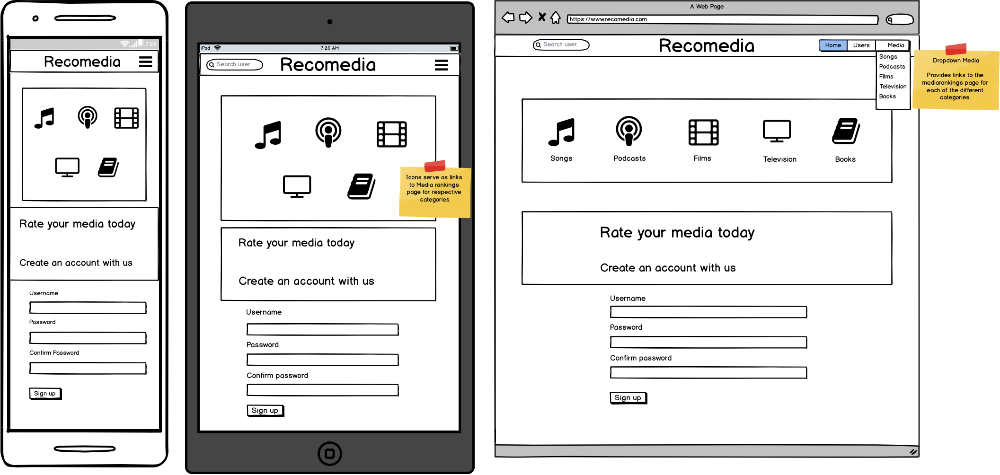
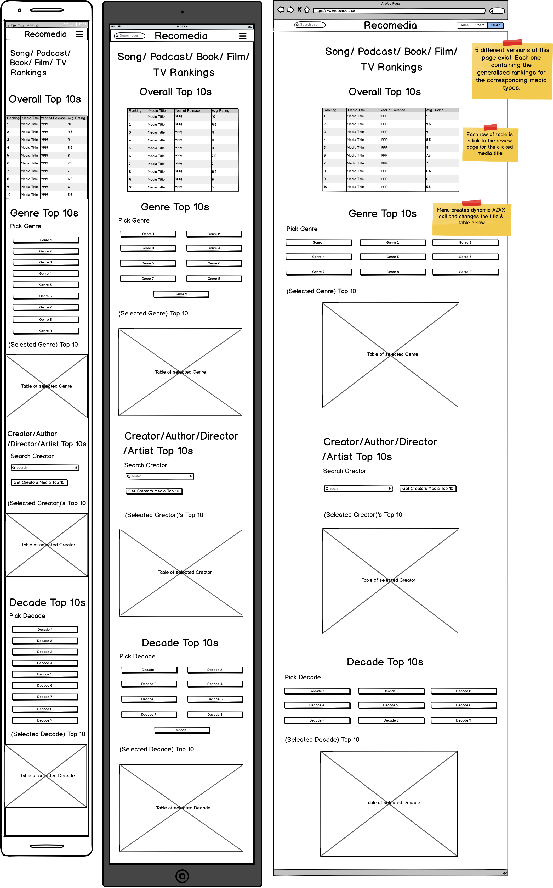
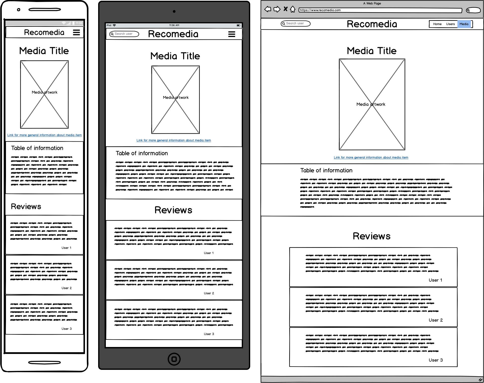
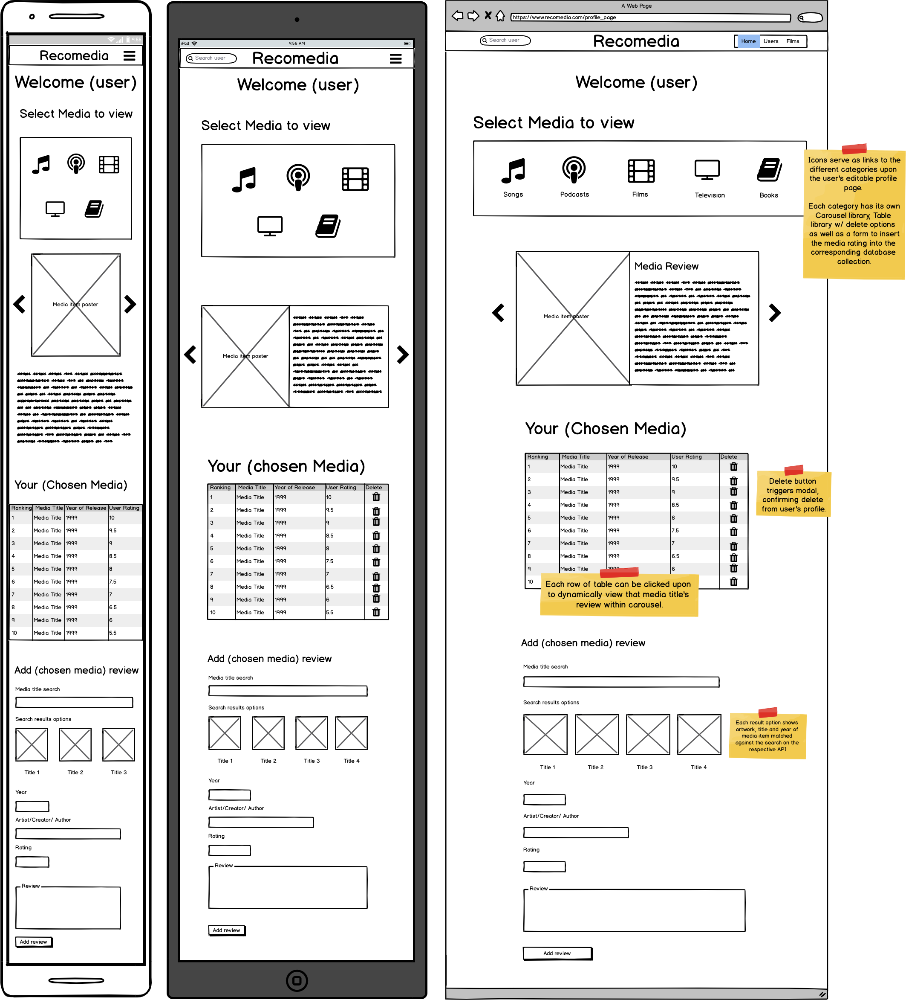
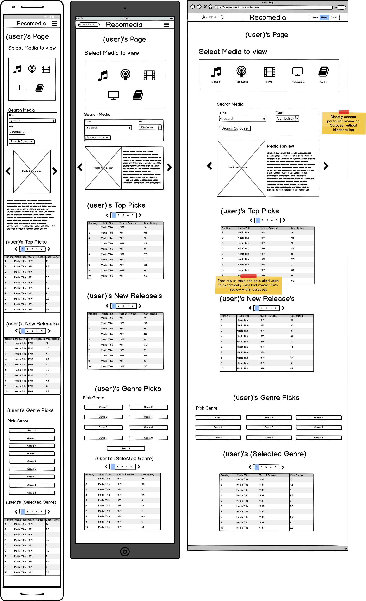

# recoMedia

An application for recommending different forms of media from films to podcasts, based on user contributions & reviews.

## Contents

1.[App Goals](#app-goals)

2.[Target Audience](#target-audience)

3.[Features](#features)

4.[Wireframes](#wireframes)

5.[Testing](#testing)

6.[Code to Website](#code-to-website)

7.[Technologies](#technologies)

8.[References](#references)

9.[Acknowledgements](#acknowledgements)

## App Goals

To build a platform for any type of media recommendations. It could serve to build an online community that would not only cater to avid film fans 
or book lovers but both and more. Although one has to be careful not to dilute the concept too much. By focusing on the 5 most popular types of media that people read reviews on;
namely films, books, podcasts, television & music the app could generate the most amount of attention & traffic.

Allow the user to create a profile and start rating different media very easily. 

The app should look inviting and trendy, perhaps reminiscent of popular streaming services available today.

Provide categories for which users can easily seek out their desired film or song choices. 

Have a fully editable profile meaning all reviews can be updated or deleted at the profile owner's request.

## Target Audience

There is no specific age range that the app targets although it would be more popular for teens upto middle-aged
 adults where technology shared amongst friends is more common.

## Features

### Essential Features
    
<ul>
<li>3 main views: 
<ol>
<li>Top 10s for overall film ratings (across all users)</li>
<li>Userprofile, whereby users can perform CRUD operations on DB, with reviews under their username.</li>
<li>Userview, which performs only read operations but for any username within the DB.</li>
</ol>
</li>
<li>Overall film rankings are sorted by descending average rating and then by ascending number of ratings (acting as a tie breaker).</li>
<li>User can select movie top 10 lists by Genre.</li>
<li>Userview and Userprofile each contain a carousel library of all the films that user has rated. Upto 300 character reviews can be read here.</li>
<li>Each row/title of userview tables is a link to the review in the carousel. Clicking the link will direct the user to the matching film slide.</li>
<li>Each row/title of the overall rankings tables is a link to the review page of the film. Where all users reviews can be seen for this selected film title.</li>
</ul>

### Bonus features

<ul>
<li>User can select movie top 10 lists by Director.</li>
<li>User can select movie top 10 lists by Decade.</li>
<li>New release section in userview (ratings sorted by date and descending rating)</li>
<li>User Profile has a public/private switch to determine whether other users can see their page or not.</li>
</ul>

### Features that won't be implemented

The following features, although quite useful in some cases and would draw more users to the app.
Will not be implemented due to time constraints on the project.

<ul>
<li>Media reviews for podcasts, songs, television & books.</li>
<li>Lists:
<ul>
<li>User has the option to add a film from another person's list (userview) to their watch list.</li>
<li>userprofile contains watch list (CRUD available/add list manually + prioritise listings).</li>
<li>Upon checking an item off a list, the user has the option to rate the film (redirect to INSERT simply add rating + review).</li>
<li>userview Show list.</li>
<li>list limit 10.</li>
</ul>
</li>
<li>Overall and user scaled statistics on genres and years of ratings created. An example could be most commonly rated genre or year.</li>
</ul>   

## Database Design

I decided to use a non-relational DB for this project due to the minimal cross over in entity dependency. After coming to the realization that
there will not be sufficient time to implement a DB collection for each media type, there will only be 2 collections, 'login' and 'films'. 

The 'films' collection will contain the typical data that one would expect such as title, year of release, director etc. Each film has to be uniquely identifiable
within the DB. I will be working with the OMDB API to retrieve film data, this is an open source movie database linked in the references. Because the API utilises
IMDB stats each film will be uniquely identified by its 'ImdbID'. 

The app's data is purely driven by user contributions. Therefore each user will give their distinct stamp whenever they rate a film. This ID will simply be their username.
The uniqueness of the username will be ensured by backend validation upon signup. The user will be the key entity that links the films to the ratings/reviews. 

The film to rating relationship is a one-to-many. Therefore ratings objects will exist as a nested group within each film document. Each rating being identified by the username 
associated with the user that inserted the rating into the collection. 

The login collection will contain a simple document structure of only the username and the user's password. 

Because username is the only link between the two entities, it doesn't make sense to use a relational DB. With a noSQL approach the processing speed of queries is much faster.

## Wireframes

### Index page

### Media Rankings page

### Review page

### Userprofile page

### Userview page

## Testing

All testing was performed manually. 

### Form validation 

#### Signup form

Test description
<ol>
<li>All three fields empty, press 'sign up'.</li> 
<li>Leave at least one empty field prior to pressing 'sign up'.</li>  
<li>Type 'space test' into username field.</li>  
<li>Type 'space test' into username field, press 'sign up'.</li>
<li>Type 'a' into 'Password' field, Type 'b' into 'Confirm Password' field.</li>
<li>Type 'nonmatching1' into 'Password' field, Type 'nonmatching2' into 'Confirm Password' field, press 'sign up'. </li>
<li>Type 'dominici' into 'Username' field, press 'sign up'. </li>
</ol>

Expected Outcome
<ol>
<li>"Please fill in this field" prompt for username.</li> 
<li>"Please fill in this field" prompt for the upper most empty field.</li> 
<li>"Username must be alphanumeric with no spaces." prompt under form appears.</li> 
<li>"Username must be alphanumeric with no spaces." prompt appears above form upon page reload.</li> 
<li>"Password Must be Matching." prompt under form appears.</li>
<li>"Passwords do not match" prompt appears above form upon page reload.</li> 
<li>"Username already exists" prompt appears above form upon page reload.</li> 
</ol>

Test passed.

#### Login form

Test description
<ol>
<li>Leave at least one empty field prior to pressing 'Login'.</li> 
<li>Type "notausername" into username field, "1234567890" into password field, press 'Login'.</li>
</ol>

Expected Outcome
<ol>
<li>"Please fill in this field" prompt for the upper most empty field.</li>
<li>"The password or username you entered is incorrect. Please try again." prompt appears above form upon page reload.</li> 
</ol>

Test passed.

#### Create Rating form

Test description
<ol>
<li>Leave all fields empty, press 'Create Rating'.</li> 
<li>Type "The Lion King", press tab, select "The Lion King (1994)" poster & press 'Create Rating'.</li>
</ol>

Expected Outcome
<ol>
<li>"A film has not yet been selected" & "The review field is empty" prompts added under form.</li>
<li>"The review field is empty" prompt added under form.</li> 
</ol>

Test passed.

### Nav Flow (Login)

The purpose of this test is to ensure that users are successfully logged in when they are supposed to be
and they are logged out automatically after 10 minutes if page refresh or CRUD operation attempted. The user should not be 
able to access the userprofile page via adding a route onto the url. The only possible login should be performed 
via the login form.

#### Whilst logged out

Test description
<ol>
<li>Add route '/userprofile' onto url.</li> 
<li>Click 'Home'/Navbar logo.</li>
<li>Observe nav bar items.</li>
</ol>

Expected Outcome
<ol>
<li>"Your login session timed out. Please login again to continue." Error message on login page.</li>
<li>User is directed to the main page showing a purple/black background with a row of film posters & sign up form.</li> 
</li>Item between 'Users' & 'Films' should be listed as 'Login'.</li>
</ol>

Test passed.

#### Whilst logged in

Test description
<ol>
<li>Wait 10 minutes after logging in, refresh page/ perform CRUD operation on rating.</li> 
<li>Click 'Home'/Navbar logo.</li>
<li>Observe nav bar items.</li>
</ol>

Expected Outcome
<ol>
<li>"Your login session timed out. Please login again to continue." Error message on login page.</li>
<li>User is directed to the userprofile page showing '/userprofile' at the end of the url & 'Logged in as {username}' status
on the left side of the nav bar.</li> 
<li>Item between 'Users' & 'Films' should be listed as 'Log out'.</li>
</ol>

Test passed.

### W3C Validation

To complete the functionality testing, I ran my code through the W3C validation service for both HTML and CSS (linked below).

HTML: https://validator.w3.org/#validate_by_input CSS : https://jigsaw.w3.org/css-validator/#validate_by_input

After validating base.html, films.html, index.html, login.html, reviews.html, userprofile.html. userview.html templates the
only errors to come back were pertaining to the Jinja2 template logic used. Since this is not actual HTML code, I ignored these errors.

After validating the CSS, errors were flagged stating the following properties were unknown:
<ul>
<li>margin-block-start</li>
<li>margin-block-end</li>
<li>margin-inline-start</li>
<li>margin-inline-end</li>
</ul>

I believe these errors are outdated, as these properties are rendered and the margins change upon deploying the app with the css in place. 
Hence errors ignored.

Also warnings were raised with regards to the '-webkit-text-stroke' property, claiming it is an unknown vendor. However this did yield
noticeable results when rendered in dev tools. The effect of colouring the outline of text to improve the contrast against the colourful
background was seen on the genre menu boxes on both the films and userview pages. Therefore warnings were ignored.

### Strict Mode

To test my javascript code I added the "use strict" statement at the top of the "script.js" file & another just below the opening script tag for the "base.html" file. 
I then ran the project via the python server and opened the console display whilst using all the features that required javascript. Features such as form validation, AJAX calls & pressing buttons.
I made a note of any errors that stopped the code from running as expected. Moving on to correct the line that raised the issue in the corresponding javascript code.

Eventually the test passed and the "use strict" statements were removed from the files.

### Compatibility

The project was ran in three different browsers: chrome, safari & firefox.

In each browser I made the following assessments:
Fonts and colour consistency- using the respective dev tools/inspector I selected each element and noted the hexadecimal color code and font type ensuring the font family, size & weight had carried over successfully from what was written in code.
Spacing, margins & alignment were consistent across all formats. Checking in a similar manner using dev tools as written above.

All tests passed.

### User test

I shared a link to the Recomedia app with my friend Guy. He was asked to set up an account and rate 5 films of his chosing. Afterwards he had to delete at least one of these films.
Then he would have to update one of the reviews from a good review to a negative one (or vice versa) and similarly change the rating value out of 10. 

This test performs all of the CRUD operations and shows that the app has no issue connecting with the database from the user's perspective. He reported back that there were no
errors and claimed that everything seemed to be working as expected.

Passed.

## Code to Website

One can very easily access the site by visiting:
https://recomedia.herokuapp.com/

## Technologies

Google's Materialize css
<ul>
<li>Side & main navigation panel</li>
<li>Grid layout (with form fields) & rows</li>
<li>Select input boxes</li>
<li>Responsiveness - hiding elements on certain resolutions.</li>
<li>Carousel functionality</li>
</ul>
CSS
<ul>
<li>Static presentation of site.</li>
</ul>
Google Font
<ul>
<li>Oxygen font</li>
</ul>
Javascript+Jquery
<ul>
<li>Dynamically alter pages content.</li>
<li>Send AJAX requests to DB.</li>
</ul>
Python 
<ul>
<li>Allowed me to communicate with the DB via PyMongo.</li>
<li>Control login/logout flow via Session.</li>
<li>Allows use of micro-framework Flask.</li>
</ul>
Flask
<ul>
<li>To facilitate url routing and template htmls, reducing the volume of code needed significantly.</li>
</ul>
Heroku
<ul>
<li>To deploy and manage the app.</li>
</ul>
MongoDB Atlas
<ul>
<li>Used to create and host the 'Recomedia' database with 'login' & 'films' collections.</li>
</ul>
Git
<ul>
<li>For managing source control.</li>
</ul>
Balsamiq
<ul>
<li>Wireframes</li>
</ul>

## References

Images used: 
https://www.pxfuel.com/en/free-photo-xcttx (horror genre)
https://www.needpix.com/photo/1095511/minions-garden-film-children-rush-movie-minion-free-pictures-free-photos (animation genre)
https://www.needpix.com/photo/249404/sherlock-holmes-detective-investigators-manhunt-search-for-clues-magnifying-glass-spy (detective genre)
https://www.needpix.com/photo/1663285/alien-space-fantasy-sci-fi-interstellar (sci-fi genre)
https://www.needpix.com/photo/download/1523135/explosion-war-soldier-run-attack-silhouette-defense-hero-military (action-genre)
https://www.flickr.com/photos/galaxyfm/415077840  (comedy-genre)
https://pxhere.com/en/photo/1373636 (romance-genre)
https://www.pikrepo.com/fxbbt/person-walking-on-pathway-between-bare-trees/download/1000x400 (thriller-genre)
    
Icons:
https://icons8.com/icon/132/search  (search icon - for inputs)

APIs:
https://www.omdbapi.com/ (used to validate film search & obtain details about films - including the posters)

## Acknowledgements

I would like to thank my friend Guy for helping me test the app and giving his much appreciated feedback. Also to my mentor Brian for his
continued support throughout this course. 